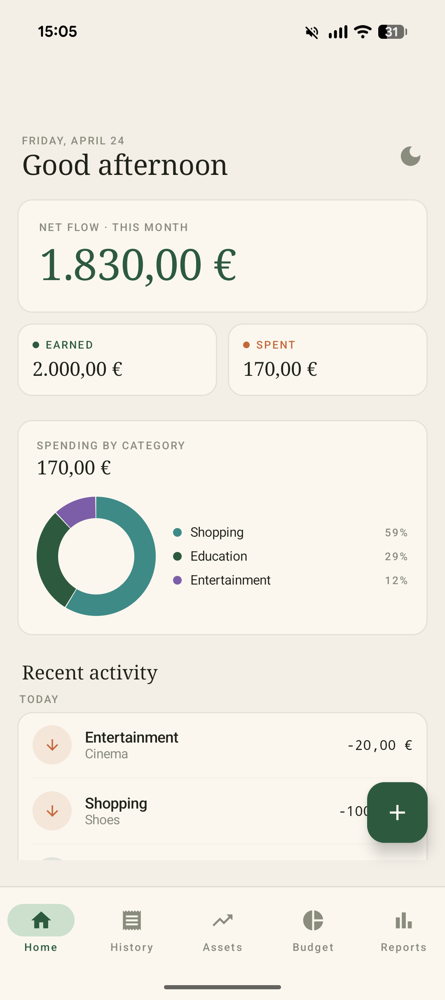
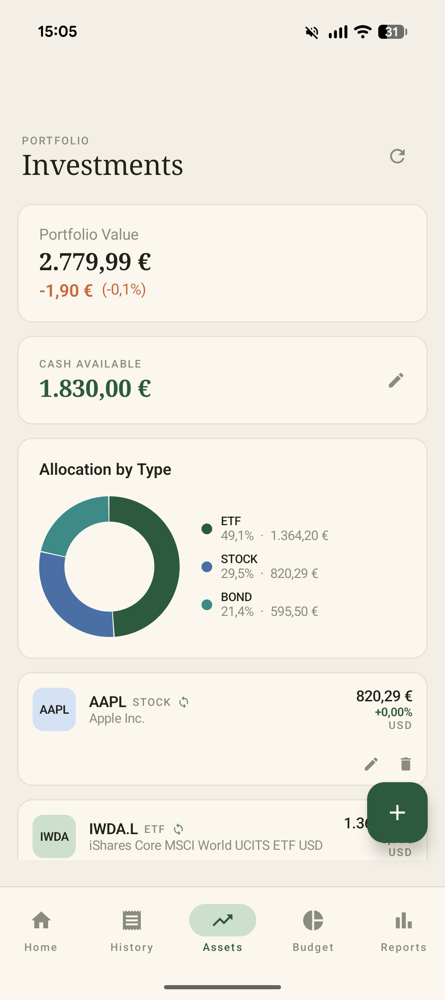
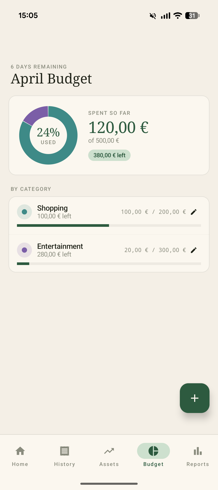
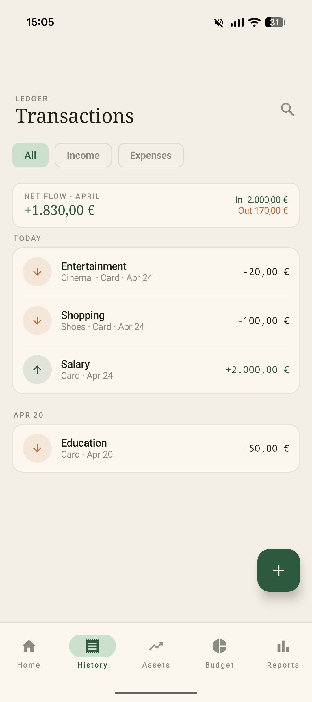
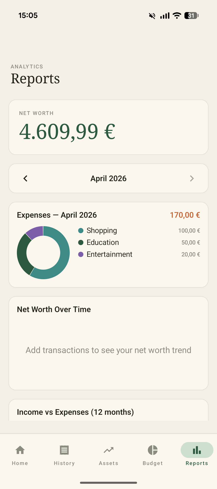

# Folio

> A clean, offline-first personal finance app for Android.

Track your spending, manage investments, and understand your financial health — all stored privately on your device. No accounts, no cloud, no tracking.

---

## Screenshots

| Home | Assets |
|:------:|:-------:|
|  |  | 

| Budget | History | Reports |
|:---------:|:------------:|:-----------:|
|  |  |  |

---

## Features

- **Home** — monthly net flow, income/expense summary, spending donut chart, recent transactions
- **History** — log income & expenses with category, account, date and notes; search, filter, swipe to delete, long-press multi-select; also log recurring transactions — daily / weekly / monthly / yearly entries generated automatically at launch
- **Assets** — track stocks, ETFs, crypto and more; search by ticker symbol or ISIN for live price lookup; portfolio breakdown chart
- **Budget** — monthly spending limits per category with colour-coded progress bars
- **Reports** — 12-month income/expense bar chart, category breakdown, net worth history
- **Dark mode** — toggle dark/light theme, persisted across sessions
- **100% offline** — all data lives in a local SQLite database on your device

---

## Download

Go to [**Releases**](../../releases) and download the latest `folio.apk`.

**To install:**
1. Download `folio.apk` on your Android device
2. Open the file — if prompted, allow installation from unknown sources in Settings
3. Tap Install

> Requires Android 8.0 (API 26) or higher.

---

## Build from source

```bash
git clone https://github.com/davideaguglia/Finance_App.git
cd Finance_App

# Build a debug APK
./gradlew assembleDebug

# Install on a connected device
adb install app/build/outputs/apk/debug/app-debug.apk
```

**Requirements:** Android Studio Hedgehog or newer · JDK 17 · Android device / emulator API 26+

---

## Tech

Kotlin · Jetpack Compose · Material Design 3 · Room · Hilt · Coroutines · WorkManager · Retrofit
